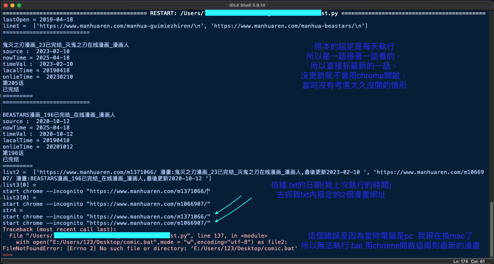
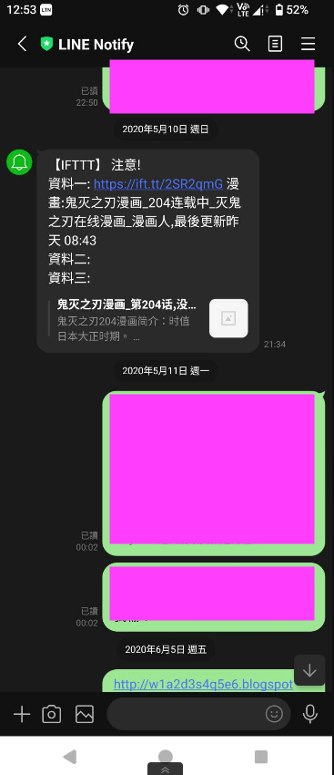

README 

# 專案名稱 爬蟲漫畫

爬“漫畫人”漫畫指定漫畫最新一話內容，適用於每日用 pc 追漫畫
將結果使用 IFTTT 發送 於 Line Notify
與 windown 電腦 comic.bat 檔
(可以搭配寫入 register 每日開機執行)

＊注意:這是我大約2019寫的所以像是 Line Notify 已經不支援了,
      還有“漫畫人”此網站也無法使用網頁的方式觀看,
      我今天發現還是可以執行附上執行結果 紀錄於 2025/4/18

## 功能 Features

- 依據目前的時間與上次紀錄的時間查詢指定漫畫的最新一話內容
- 最新的搜尋結果會寫入 comic.bat

## 使用技術 Tech Stack
- time
- datetime
- requests
- os
- IFTTT

## 安裝與執行方式 Getting Started

1. Clone 此專案：
    ```bash
    git clone https://github.com/e412139/ParserComic.git
    ```
2. 執行 webGost.y 檔案即可使用 (注意要修改 IFTTT key, 與你最後輸出 .bat 的位址)

3. dateInfo.txt 紀錄上次開啟的日期與你追中的漫畫

4. 新增方式參考現有格式填寫
   
5. 電腦手動執行點擊 comic.bat 自動執行 chrome 開啟爬到的最新漫畫

## 測試結果 
- line以前的截圖 另一張是最近運行的結果
- 
- 
   
